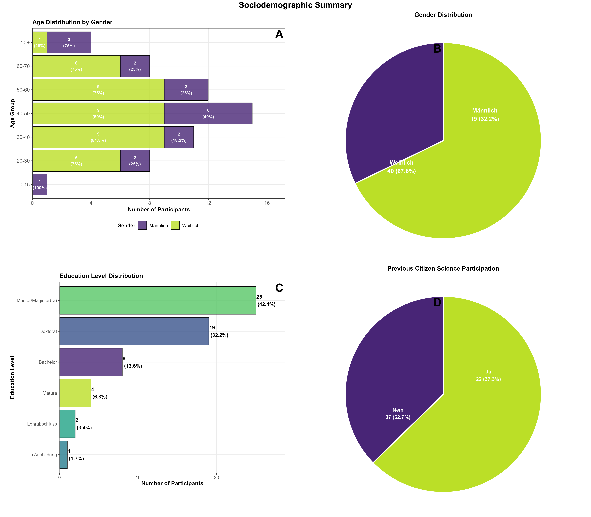
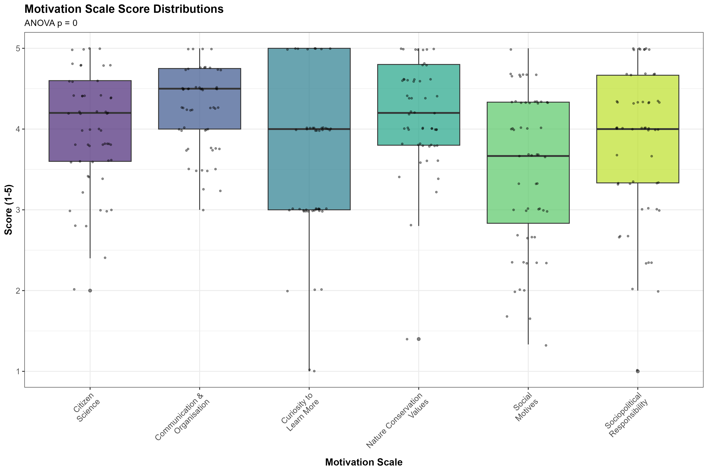
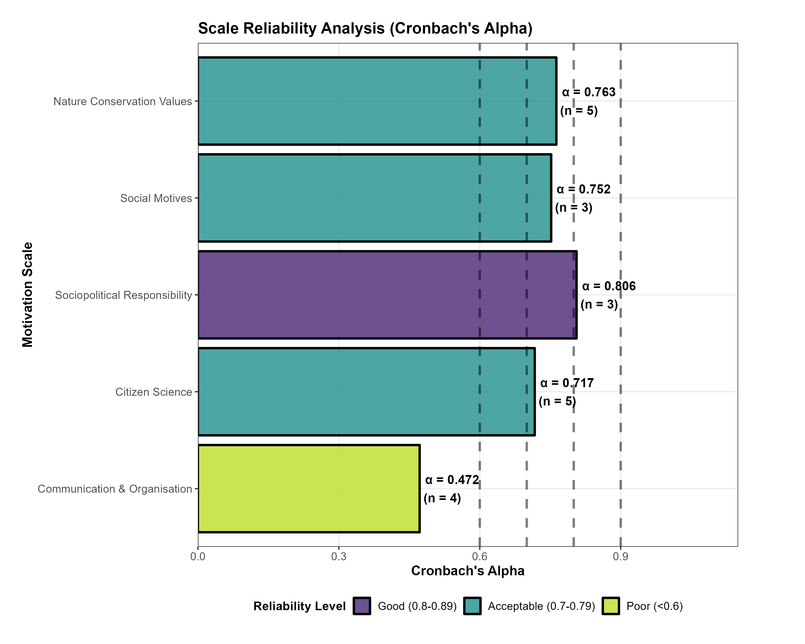
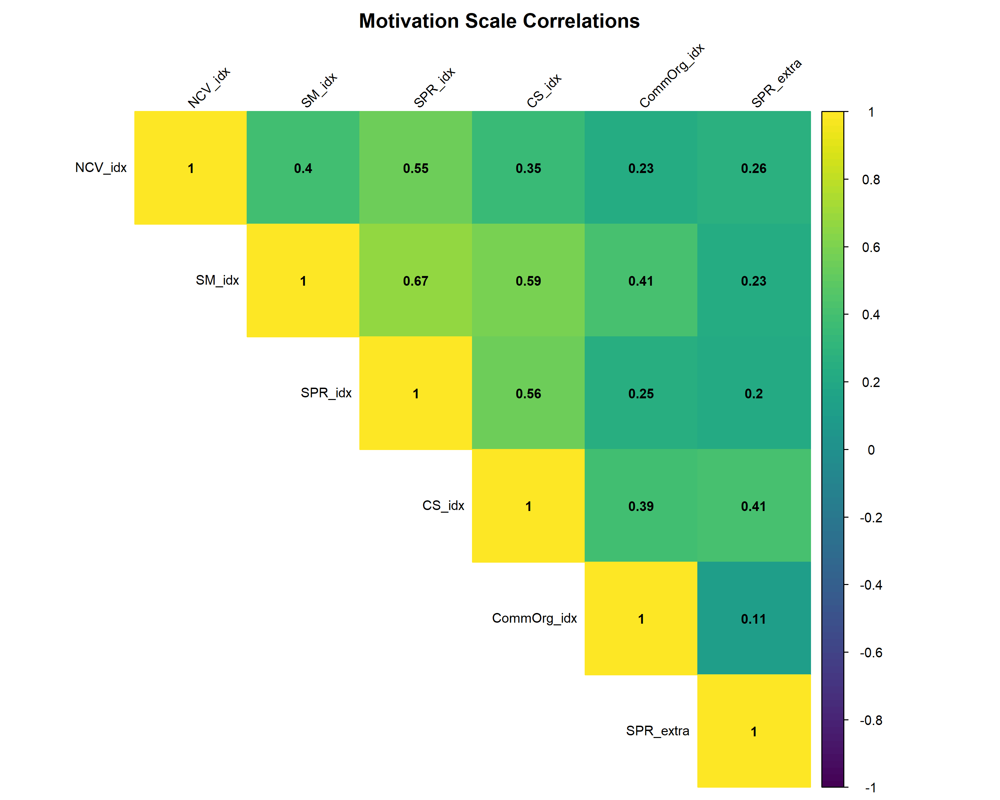

# Vienna *Drosophila* Citizen Science Survey Analysis

[](https://github.com/capoony/DrosophilaCitizenScience)
[](https://www.r-project.org/)
[](LICENSE)

## 📊 Comprehensive Survey Data Analysis for the ViennaCityFly Project

This repository contains a **complete statistical analysis pipeline** for citizen science survey data from the Vienna *Drosophila* ecology project. The analysis provides comprehensive insights into participant demographics, motivations, engagement patterns, and project outcomes through robust statistical methods and professional visualizations.

---

## 🎯 Analysis Overview

### **Project Context**

| Attribute | Details |
|-----------|---------|
| **Study** | ViennaCityFly - Urban *Drosophila* Ecology Research |
| **Focus** | Citizen science participant survey analysis |
| **Institution** | Naturhistorisches Museum Wien |
| **Sample Size** | N = 59 participants |
| **Analysis Date** | September 2025 |
| **Status** | ✅ Complete |

### **Research Questions**

This analysis addresses five core research questions:

1. **Demographics**: What are the sociodemographic characteristics of participants?
2. **Motivation**: What motivates people to participate in citizen science projects?
3. **Reliability**: How reliable are motivation measurement scales?
4. **Engagement**: What is the level of participant engagement and satisfaction?
5. **Improvement**: What improvements do participants suggest for future projects?

---

## 📋 Analysis Components

### **1. Sociodemographic Analysis** 👥

Comprehensive descriptive analysis of participant characteristics across six key dimensions:

| Variable | Description |
|----------|-------------|
| **Age Distribution** | Participant age groups with gender breakdown |
| **Gender Distribution** | Gender representation in the study |
| **Education Level** | Highest level of education achieved |
| **Project Awareness** | How participants learned about the project |
| **Previous Experience** | Prior citizen science participation (Yes/No) |
| **Active Participation** | Whether participants contributed traps (Yes/No) |



**Figure 1:** Comprehensive demographic overview of study participants

**Key Files:**

- `results/tables/sociodemographic_analysis.csv` - Complete demographic statistics
- `results/plots/demographic_summary_combined.pdf|png` - Combined visualization panel

### **2. Motivation Scale Development** 🎯

Creation and validation of motivation indices based on established psychological frameworks:

#### **Motivation Indices Calculated**

| Index | Description | Items | Scale |
|-------|-------------|-------|-------|
| **NCV_idx** | Nature Conservation Values | NCV1-NCV5 | 5-point Likert |
| **SM_idx** | Social Motives | SM1-SM3 | 5-point Likert |
| **SPR_idx** | Sociopolitical Responsibility | SPR1-SPR3 | 5-point Likert |
| **CS_idx** | Citizen Science Interest | CS1-CS5 | 5-point Likert |
| **CommOrg_idx** | Communication & Organization | COMM3, ORG1, ORG3, ORG4 | 5-point Likert |
| **SPR_extra** | Curiosity to Learn More | Single item | 5-point Likert |
| **MeanMotivationOverall** | Overall motivation index | All subscales | Composite |

> **Calculation Method:** Each index = Mean of constituent items (minimum 50% items required)

**Key Files:**

- `results/tables/motivation_descriptives.csv` - Descriptive statistics for all scales
- `results/plots/motivation_boxplots.pdf|png` - Distribution visualizations
- `results/plots/motivation_means_barplot.pdf|png` - Mean scores comparison



**Figure 2:** Distribution patterns across all motivation scales

### **3. Reliability Analysis** 📊

Cronbach's alpha reliability assessment for motivation subscales using established psychometric standards:

#### **Reliability Interpretation Standards**

| Range | Interpretation | Quality |
|-------|----------------|---------|
| **α ≥ 0.9** | Excellent | ✅ Highly reliable |
| **α = 0.8-0.89** | Good | ✅ Reliable |
| **α = 0.7-0.79** | Acceptable | ⚠️ Moderately reliable |
| **α = 0.6-0.69** | Questionable | ⚠️ Low reliability |
| **α < 0.6** | Poor | ❌ Unreliable |

> **Note:** SPR_extra excluded from reliability analysis (single item, analyzed separately)

**Key Files:**

- `results/tables/reliability_analysis.csv` - Complete reliability statistics
- `results/plots/reliability_analysis.pdf|png` - Visual reliability assessment



**Figure 3:** Cronbach's alpha reliability assessment for each motivation subscale

### **4. Descriptive Statistics**

Comprehensive descriptive analysis including:

- **Central Tendencies**: Mean, median for all motivation scales
- **Variability**: Standard deviation, min/max values
- **Sample Sizes**: Valid responses per scale
- **Distribution Characteristics**: Boxplots with outlier identification

### **5. Statistical Testing**

Advanced statistical analysis procedures:

- **ANOVA**: Between-group differences in motivation scales
- **Post-hoc Testing**: Bonferroni-corrected pairwise comparisons
- **Correlation Analysis**: Inter-scale relationships
- **Significance Testing**: p-values for all correlations

**Key Files:**

- `results/tables/motivation_pairwise_tests.csv` - Significant pairwise differences
- `results/tables/motivation_correlations.csv` - Correlation matrix
- `results/plots/motivation_correlation_plot.pdf|png` - Visual correlation matrix



**Figure 4:** Inter-scale correlation matrix showing relationships between motivation dimensions

### **6. Engagement Analysis**

In-depth analysis of participant engagement patterns:

#### **Engagement Variables:**

- **Impact Assessment**: "Was hat sich durch Ihre Teilnahme an dem Projekt verändert?"
- **Contentment**: "Wie zufrieden waren Sie insgesamt mit Ihrer Teilnahme an dem Projekt?"
- **Future Involvement**: "Haben Sie vor, auch weiterhin an Citizen Science Projekten teilzunehmen?"

**Analysis Method**: Comma-separated response analysis for multi-option questions

**Key Files:**

- `results/tables/Impact_Analysis_*.csv` - Detailed impact categorization
- `results/tables/Contentment_Analysis_*.csv` - Satisfaction analysis
- `results/tables/Future_Involvement_*.csv` - Future participation intentions

---

## 🔧 Technical Implementation

### **Software Environment**

- **Language**: R (version 4.x+)
- **Key Packages**:
  - `tidyverse` - Data manipulation and visualization
  - `psych` - Reliability analysis and descriptive statistics
  - `ggplot2` - Advanced plotting
  - `corrplot` - Correlation visualizations
  - `gridExtra` - Multiple plot arrangements
  - `viridisLite` - Accessible color palettes

### **Analysis Pipeline**

1. **Data Loading**: Excel file import with error checking
2. **Variable Validation**: Exact column name matching
3. **Index Calculation**: Motivation scale computation with missing data handling
4. **Reliability Testing**: Cronbach's alpha with sample size validation
5. **Statistical Analysis**: ANOVA, correlations, pairwise testing
6. **Visualization**: Professional plots with consistent styling
7. **Export**: Multiple format outputs (CSV, PDF, PNG)

### **Quality Assurance**

- **Validation Checklist**: Automated verification of all required analyses
- **Error Handling**: Robust missing data management
- **Reproducibility**: Complete analysis pipeline in single script
- **Documentation**: Comprehensive code commenting and output logging

---

## 📁 File Structure

```
DrosophilaCitizenScience/
├── data/
│   └── Survey_Data_analysis - Kopie.xlsx
├── scripts/
│   └── clean_survey_analysis.R
├── results/
│   ├── tables/                           # CSV data outputs
│   │   ├── sociodemographic_analysis.csv
│   │   ├── motivation_descriptives.csv
│   │   ├── reliability_analysis.csv
│   │   ├── motivation_correlations.csv
│   │   ├── noteworthy_findings_summary.csv
│   │   └── analysis_validation_checklist.csv
│   ├── plots/                            # Visualization outputs
│   │   ├── demographic_summary_combined.pdf|png
│   │   ├── reliability_analysis.pdf|png
│   │   ├── motivation_boxplots.pdf|png
│   │   ├── motivation_means_barplot.pdf|png
│   │   ├── motivation_correlation_plot.pdf|png
│   │   └── [individual plot files]
│   └── analysis_summary.rds             # Complete analysis summary
└── README.md                            # This documentation
```

---

## 🚀 Quick Start Guide

### **Prerequisites**

Ensure you have R version 4.0 or higher installed:

```r
# Check R version
R.version.string

# Install package manager (if needed)
if (!require(pacman)) install.packages("pacman")

# Install all required packages
pacman::p_load(
    readxl, tidyverse, psych, knitr, ggplot2, 
    corrplot, gridExtra, grid, scales, 
    RColorBrewer, viridisLite, ggsignif, 
    ggpubr, rstatix
)
```

### **Running the Analysis**

```r
# Clone repository and set working directory
setwd("path/to/DrosophilaCitizenScience")

# Execute complete analysis pipeline
source("scripts/clean_survey_analysis.R")
```

### **System Requirements**

| Requirement | Specification |
|-------------|---------------|
| **R Version** | ≥ 4.0.0 |
| **Memory** | 50-100 MB RAM |
| **Runtime** | 2-5 minutes |
| **Output Files** | 20+ files generated |

---

## 📈 Key Findings Summary

### **📊 Participant Demographics**

| Metric | Finding | Details |
|--------|---------|---------|
| **Sample Size** | N = 59 | Complete survey responses |
| **Age Distribution** | 40-50 years (25.4%) | Largest participant group |
| **Gender Balance** | 67.8% female | 40 female, 19 male participants |
| **Education Level** | Highly educated | 42.4% Master's, 32.2% Doctorate |
| **CS Experience** | 62.7% newcomers | 37 first-time, 22 experienced |
| **Active Participation** | 76.3% contributed | 45 provided traps, 14 did not |

### **🎯 Motivation Analysis**

| Rank | Scale | Mean | SD | Interpretation |
|------|-------|------|----|----|
| 1 | Communication & Organisation | 4.29 | 0.53 | Highest motivation |
| 2 | Nature Conservation Values | 4.24 | 0.66 | Very high |
| 3 | Citizen Science Interest | 4.03 | 0.72 | High |
| 4 | Sociopolitical Responsibility | 3.89 | 0.95 | Moderate-high |
| 5 | Curiosity to Learn More | 3.76 | 1.12 | Moderate |
| 6 | Social Motives | 3.57 | 0.99 | Lowest (but still positive) |

### **🔍 Reliability Assessment**

| Scale | Cronbach's α | Interpretation | Status |
|-------|--------------|----------------|--------|
| Sociopolitical Responsibility | 0.81 | Good | ✅ Reliable |
| Nature Conservation Values | 0.76 | Acceptable | ✅ Reliable |
| Social Motives | 0.75 | Acceptable | ✅ Reliable |
| Citizen Science Interest | 0.72 | Acceptable | ✅ Reliable |
| Communication & Organisation | 0.47 | Poor | ⚠️ Needs improvement |

### **💡 Engagement Outcomes**

- **📈 Overall Satisfaction**: Extremely high (66.1% rated 5/5, 84.7% rated 4-5/5)
- **🔄 Future Participation**: 100% plan to continue with citizen science projects
- **🎯 Project Impact**: Comprehensive positive impact across multiple dimensions

### **🚀 Key Recommendations**

1. **Methodological**: Improve Communication & Organisation scale reliability (α = 0.47)
2. **Strategic**: Leverage exceptional satisfaction rates for recruitment and testimonials
3. **Research**: Investigate Social Motives development opportunities

---

## 📚 References & Methodology

### **Theoretical Framework**

- Motivation scales based on established citizen science literature
- Reliability standards following Cronbach & Meehl (1955)
- Statistical testing procedures per Field (2013)

### **Analysis Standards**

- **Missing Data**: Pairwise deletion with 50% threshold
- **Statistical Significance**: α = 0.05 (Bonferroni corrected for multiple comparisons)
- **Effect Size**: Practical significance considered alongside statistical significance
- **Visualization**: Colorblind-friendly viridis palette throughout

### **Reproducibility**

- **Seed Setting**: Ensures reproducible results
- **Version Control**: Git-tracked analysis pipeline
- **Environment Documentation**: Complete package version logging
- **Data Validation**: Automated checks for data integrity

---

**Last Updated**: September 22, 2025  
**Analysis Version**: 2.0  
**Status**: ✅ Complete & Validated  

---

> 💡 **Note**: This README is automatically synchronized with analysis results. For the most current findings, run the analysis script and check generated output files.

---

**ViennaCityFly Project | Naturhistorisches Museum Wien**  
*Advancing citizen science through rigorous statistical analysis*
